#Crie um Experimento com o Azure Machine Learning

##**Renato Haddad**
**MVP ASP.NET /MCP/MCTS/MCPD/RD**
Setembro, 2016

[Blog](http://weblogs.asp.net/renatohaddad/)

A Microsoft tem disponível aos assinantes do Azure uma máquina de aprendizado, chamada de Azure Machine Learning, o qual permite simular uma infinidade de cenários estatísticos a partir de uma base de dados. O objetivo deste artigo é guia-los passo a passo na montagem de um experimento através da aplicação de um modelo de regressão linear.

Tudo começa em https://studio.azureml.net, conforme a figura 1, o qual você deverá se logar com sua conta da Microsoft.

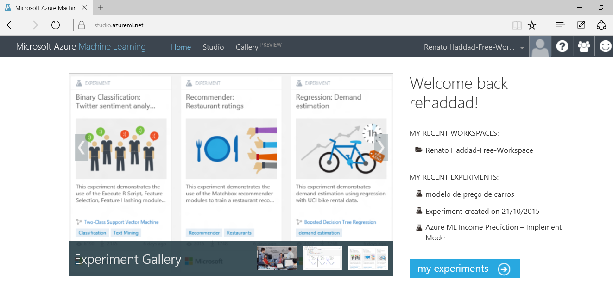

Figura 1 – Tela inicial do Azure Machine Learning

Toda a interface é online, não há nada offline ou local, então na lista de menu na barra superior, você tem a opção chamada Studio (estúdio). Clique nela para acessar a ferramenta, sendo que quando o acesso é feito pela primeira vez ou navega na página principal, é exibida uma janela convidando para um vídeo passo a passo com 5 fases, assim terá uma visão geral. Cabe a você aceitar ou não, eu acho válido para um primeiro contato com o Studio.

A figura 2 mostra a ferramenta Studio com os módulos existentes, os quais descreverei a seguir a funcionalidade de cada um. Esta ferramenta é colaborativa com recursos de arrastar e soltar, configurar propriedades onde você cria, testa e implanta soluções de análise preditiva de dados.

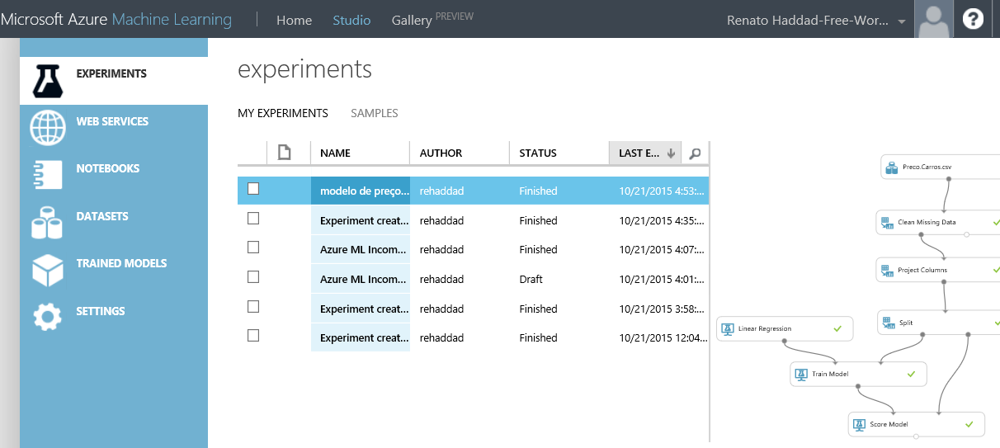

Figura 2 – Módulos existentes

O que contém cada módulo? Vou listar e comentar os 6 módulos disponíveis atualmente.

EXPERIMENTS – é o local onde você cria os experimentos / testes, arrasta componentes para conectá-los a outros, preparar os dados, caso necessário, aplicar modelos para treinar, pontuar, testar e avaliar o experimento, conforme a figura 3.

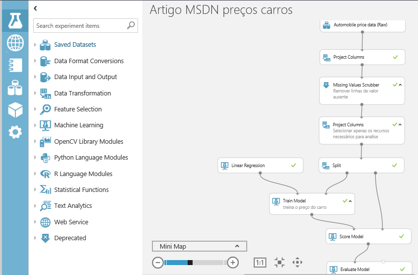

Figura 3 – Tela de Experimentos

WEB SERVICES – lista de testes publicados que podem ser acessados via Web API ou ferramentas de BI como Excel, através de um token gerado de acordo com a sua conta.

NOTEBOOKS – lista de códigos criados em phyton para auxiliar customizações dos dados nos componentes, conforme a figura 4.

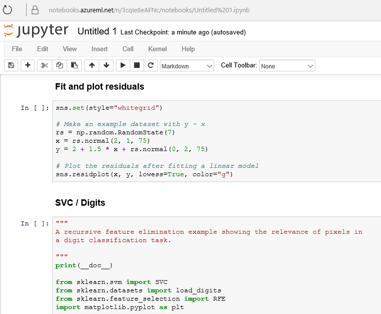

Figura 4 – Código do notebook

DATASETS – lista das fontes de dados que você importou ou fez uso das diversas fontes online disponíveis no próprio Studio. Neste artigo usaremos uma fonte online.

TRAINED MODELS – lista de testes treinados por você a serem aplicados nos componentes.

SETTINGS – dados da sua conta, percentual usado, tokens a serem distribuídos e lista de usuários com acesso aos testes e resultados.

# Criar um Experimento / Teste

Um termo comum usado no Azure Machine Learning é a ciência dos dados, os quais os cientistas afirmam que não existe um modelo de algoritmo melhor ou pior para cada experimento. É preciso testar diversos para analisar os dados e chegar a uma conclusão, pois tudo depende do objetivo a ser atingido.

Todo experimento tem as seguintes etapas: obter dados / pré-processar dados / definir recursos / treinar o modelo de acordo com o algoritmo de aprendizado / pontuar e testar o modelo. Vamos criar um experimento completo até obtermos os dados finais já analisados.

No rodapé da tela (vou chamar de barra de menu inferior) clique no botão New e selecione o menu EXPERIMENT. Conforme a figura 5, existem muitos exemplos prontos, cada um com uma finalidade, um modelo de algoritmo diferente, vale a pena uma pesquisa de exemplos para entender a complexidade dos mesmos. No nosso caso, selecione o primeiro, Blank Experiment (experimento em branco).

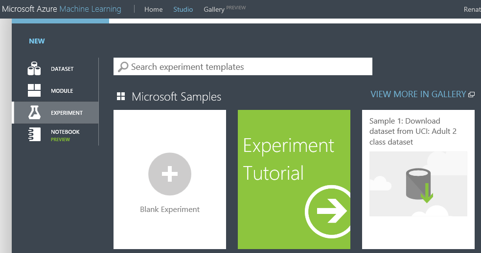

Figura 5 – Novo experimento

Note que na parte do meio da tela contém os blocos para você arrastar os componentes. E, o primeiro passo é informar a fonte de dados. No lado esquerdo, são exibidos diversos nós, e o primeiro deles é Saved Datasets. Expanda este nó, e em seguida o Samples, conforme a figura 6.

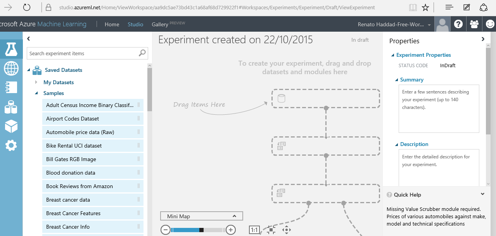

Figura 6 – Fontes de dados Samples

Veja que a lista de fontes de dados é grande, então, usaremos o “Automobile price data (Raw)”, o qual contém dados sobre diversos automóveis, e ao final o teste definirá o preço final. Então, selecione esta fonte e arraste-a para o primeiro bloco. E, conforme a figura 7, caso queira visualizar os dados, clique com o botão direito sobre a fonte, selecione dataset / Visualize. Veja ainda na janela de propriedades, que o arquivo está no formato CSV e se quiser fazer download, clique no link Vew dataset.

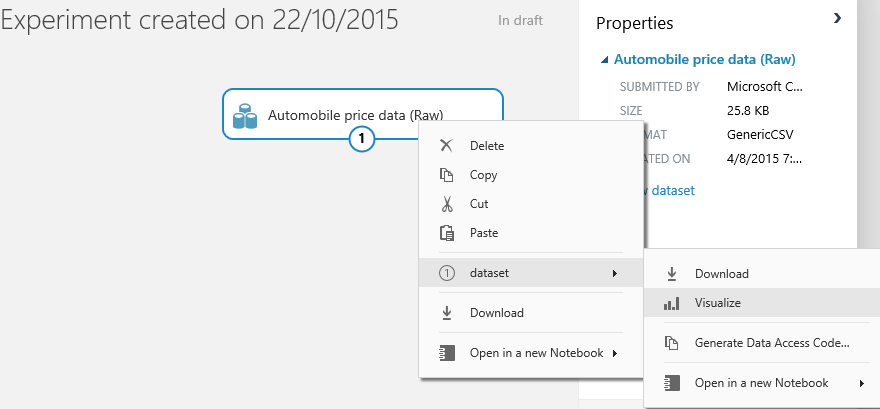

Figura 7 – Fonte de dados dos carros

Como saber se os dados estão corretos para o experimento? Uma regra básica para isto é não deixar valores em branco nas colunas, pois isto afetará diretamente o algoritmo. Visualize os dados conforme a figura 7, e veja todas as colunas com os dados. Selecione a coluna “normalized-losses”, observe as estatísticas e note que há 41 valores em branco, conforme a figura 8.

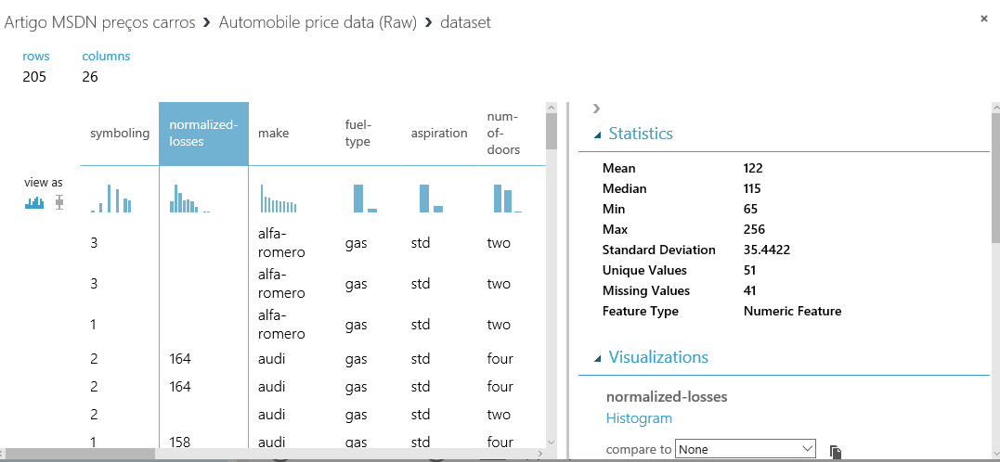

Figura 8 – Estatística de uma coluna

Uma vez constatado que a quantidade de valores em branco na coluna “normalized-losses” é grande, a melhor coisa a fazer é isolar esta coluna, ou seja, retirá-la da fonte dados para análise. Antes de mais nada, do lado esquerdo da tela, há uma caixa de pesquisa dos componentes, o qual você pode digitar parte do nome que a ferramenta filtra. Neste caso, digite “Project col”, conforme a figura 9. Veja que o componente Project Columns é exibido na lista, então, arraste-o abaixo da fonte de dados no gráfico.

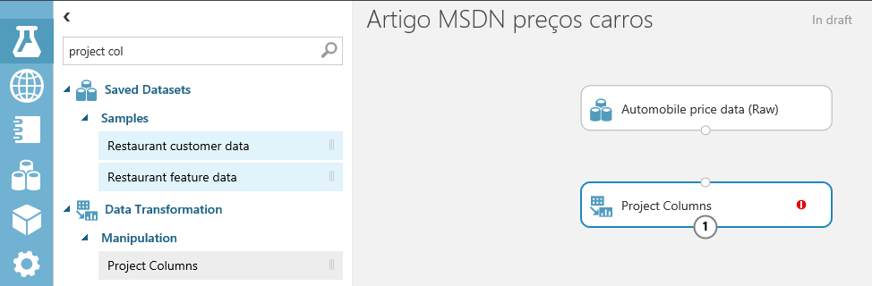

Figura 9 – Filtrar componentes

Em seguida é preciso conectar os dois blocos, então, clique no círculo em branco do primeiro bloco e arraste o mouse até o círculo branco do segundo bloco. Isto indicará uma origem e destino dos mesmos. Agora é preciso excluir a coluna “normalized-losses”, então, selecione o Project Columns. Automaticamente do lado direito são exibidas as propriedades contendo o botão “Launch column selector”. Clique nele, na janela aberta, selecione em “Begin With: All Columns”. Em seguida, precisamos dizer que excluiremos tal coluna da lista, então, selecione “Exclude / column names”. Aguarde alguns segundos para que a ferramenta carregue todas as colunas na lista. Por fim, selecione “normalized-losses” e clique no botão de confirmar, conforme a figura 10.

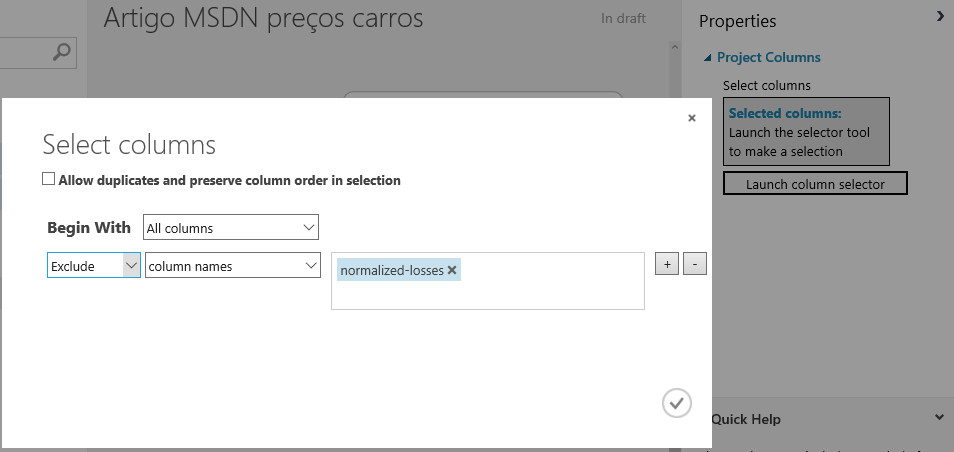

Figura 10 – Selecionar coluna para exclusão

E o que fazer com todas as linhas que contém valores em branco? Nada mais justo e seguro do que excluí-las, assim garantimos ainda mais os dados a serem analisados. Pesquise o componente Missing, e quando aparecer o “Missing Values Scrubber”, arraste-o para o gráfico. Conecte com o bloco anterior (Project Columns) e nas propriedades, configure a opção “For missing values” para “Remove entire row”, ou seja, caso tenham valores ausentes, exclua toda a linha. E, para efeito de documentação, você pode dar um duplo clique no componente e colocar um texto explicativo. Veja na figura 11 como deverá estar a sua tela.

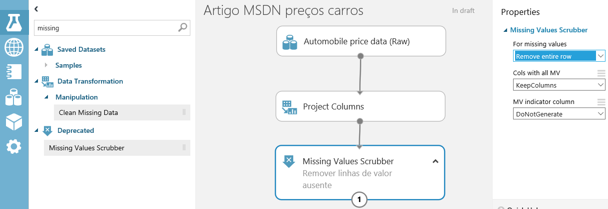

Figura 11 – Componente para remover linhas com valores ausentes

Perceba que aos poucos vamos preparando os dados para que o algoritmo seja treinado de acordo com a necessidade e o objetivo a ser atingido. Imagine que você tivesse uma lista enorme de colunas desnecessárias para a análise dos dados, de nada valeria isto se o foco é apenas definir o preço dos carros. Com isto, no Azure Machine Learning, devemos focar nos recursos, os quais na nossa base de dados dos carros, cada coluna é entendida como um recurso.

Adicione mais um componente“Project Columns”, conecte-o ao último inserido e nas propriedades, clique no botão “Launch column selector”. Em “Begin With” selecione “All columns”, e em seguida, inclua todas as colunas listadas na figura 12. Sendo assim, o modelo a ser treinado conterá somente estas colunas.

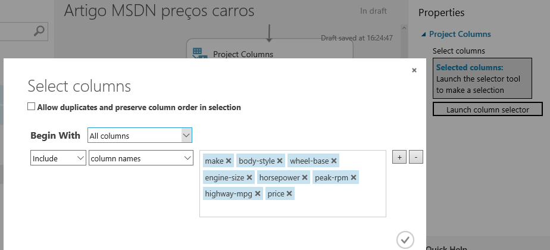

Figura 12 – Recursos a serem treinados.

# Aplicar um Algoritmo

Uma vez com os dados no ponto certo, você deverá escolher um algoritmo e testar. Faça isto quantas vezes forem necessárias até atingir o objetivo. Neste caso, o foco é descobrir qual será o preço do carro, então usaremos um algoritmo de regressão linear. E, para isto, precisamos treinar parte dos nossos dados. Isto mesmo, você pode definir um percentual de dados para que o modelo seja treinado e depois aplicado. Para isto, pesquise o componente “Split” (dividir) e arraste-o no gráfico. Conecte-o com o anterior, como é uma sequência, não há o que errar. Nas propriedades do “Split”, conforme a figura 13, defina 0.8 em “Fraction of rows in the first output dataset”, ou seja, estamos configurando em 80% dos dados para treinamento e 20% para o teste.

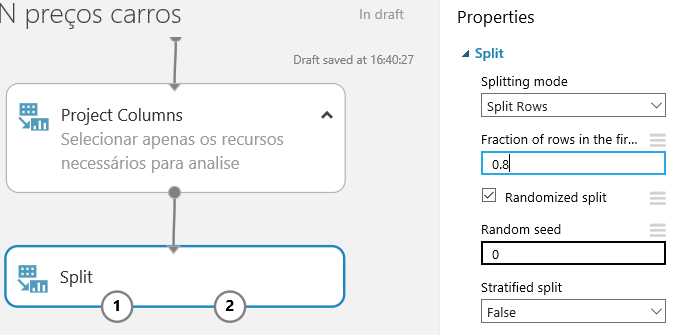

Figura 13 – Dividir percentual de treino e teste

No rodapé clique no botão Save e nomeie como “Artigo MSDN preços carros”. Em seguida, vamos executar o experimento, basta clicar no botão Run. Aguarde alguns minutos até a execução de cada componente. Você pode acompanhar isto visualmente, pois a cada término é colocado um ícone verde no componente.

Na lista de módulos, expanda o Machine Learning / Initialize Model / Regression, e conforme a figura 14, veja todos os modelos de regressões disponíveis.

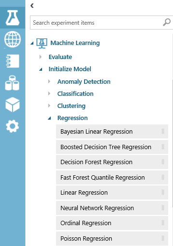

Figura 14 – Modelos de regressões

Para este experimento, arraste o “Linear Regression” (regressão linear) para o gráfico. Logo a seguir, localize o modelo de treinamento a ser usado, neste caso usaremos o “Train Model”, que está em Machine Learning / Train, conforme a figura 15. Arraste-o no gráfico do experimento.

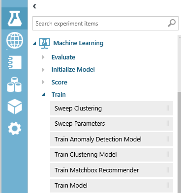

Figura 15 – Modelos de treinamentos

Veja na figura 16, como que as ligações devem ser estabelecidas. Tanto a regressão linear como o Split são ligados ao modelo de treinamento. Não se preocupe em errar, pois qualquer outra tentativa de ligação entre os módulos não seria aceita.

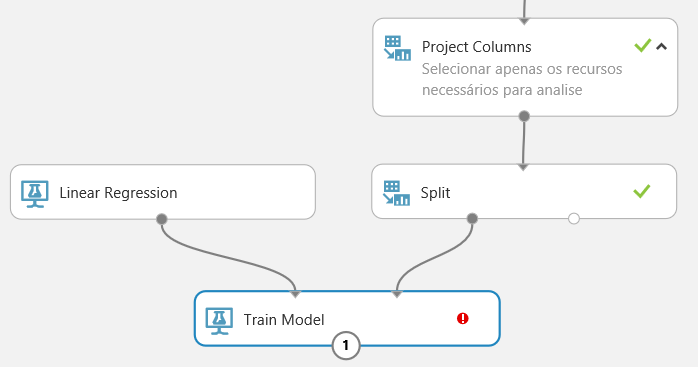

Figura 16 – Módulos de regressão e treinamento definidos

Mas, note que o “Train Model” contém uma exclamação vermelha, indicando que falta configurar algo. E, como queremos focar no preço, nas propriedades do “Train Model”, clique no botão “Launch column selector” e inclua a coluna “price”, conforme a figura 17. Isto é muito importante, pois as colunas incluídas na lista são as que serão testadas.

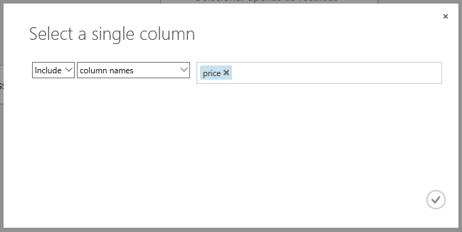

Figura 17 – Recurso a ser avaliado

Pronto, está tudo pronto e configurado. Clique no botão Run para rodar o experimento completo, resultando num modelo de regressão a ser usado para fazer previsões.

Lembre-se que treinamos o modelo com 80% dos dados, e os outros 20% podemos aplicar este treinamento e comparar se o modelo funcionará conforme o esperado no modelo de avaliação (Score Model). Para isto, pesquise o componente “Score Model” (Machine Learning / Score), arraste-o no gráfico do experimento e faça as ligações conforme a figura 18, sendo o “Train Model” e o “Split” diretamente no “Score Model”.

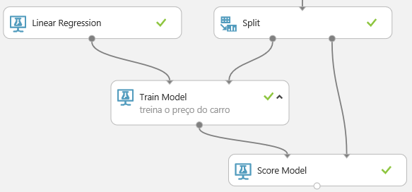

Figura 18 – Modelo de avaliação

Para finalizar, clique no botão Run para rodar o experimento novamente. Para visualizar o resultado final, clique com o botão direito no “Score Model”e selecione “Scored dataset / visualize”. Teremos uma tela conforme a figura 19, mostrando uma nova coluna chamada “Scored Labels”, com os preços previstos e conhecidos dos dados de teste.

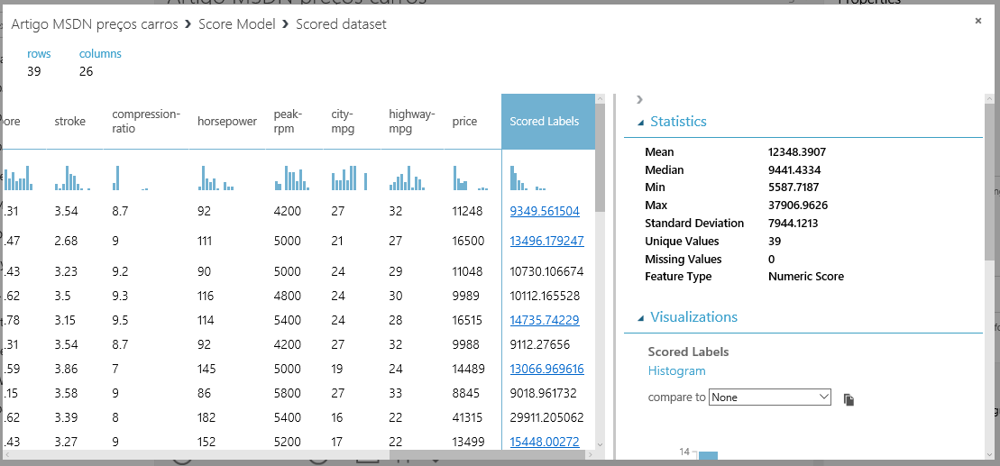

Figura 19 – Preços previstos e conhecidos

O que já temos é o suficiente, no entanto, como avaliar a qualidade dos resultados realizados no teste? Será que o resultado do experimento é satisfatório? Como saber números estatísticos do modelo aplicado? Para isto, localize e arraste o componente “Evaluate Model”, conectando-o ao “Score Model”, conforme a figura 20. Isto servirá para testarmos a qualidade dos resultados.

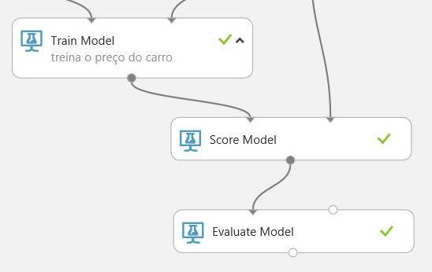

Figura 20 – Modelo de avaliação

Execute novamente o experimento, e ao finalizar, mostre os resultados do “Evaluate Model”. Veja as estatísticas, conforme a figura 21, trazendo a média de erros absolutos (Mean Absolute Error), é a diferença entre o preço previsto e o real. Raiz quadrada dos erros ao quadrado (Root Mean Squared Error), é a raiz quadrada da média de erros quadrados de previsões feitas no teste. Erro absoluto relativo (Relative Absolute Error), é a diferença absoluta entre os valores reais e a média de valores reais. Erro ao quadrado relativo (Relative Squared Error), é a média de erros quadrados relativos à diferença quadrada entre os valores reais e a média de todos os valores reais. Coeficiente de Determinação (Coefficient of Determination), é uma métrica que indica se o modelo se encaixa bem nos dados. Quanto menor o valor, significa que as previsões se aproximam dos valores reais, e quanto mais próximo 1, melhores as previsões.

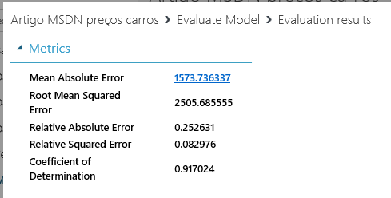

Figura 21 – Estatísticas da avaliação

# Conclusão
Diante de terabytes de informações existentes no mundo, analisar dados de forma eficaz através de modelos estatísticos, é sem dúvida o melhor caminho que uma empresa e pesquisas podem focar em resultados. A Microsoft nos trouxe a este novo mundo com uma ferramenta fantástica de aprendizado para nos auxiliar na tomada de decisões.

# Sobre o Autor
Renato Haddad (rehaddad@msn.com  – www.renatohaddad.com) é MVP, MS Regional Director, MCPD e MCTS, palestrante em eventos da Microsoft em diversos países, ministra treinamentos focados em produtividade com o VS.NET 2013/2015, ASP.NET 4/5, Entity Framework, Reporting Services, Windows Phone e Windows 8. Visite o blog http://weblogs.asp.net/renatohaddad.
