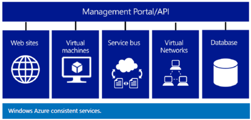
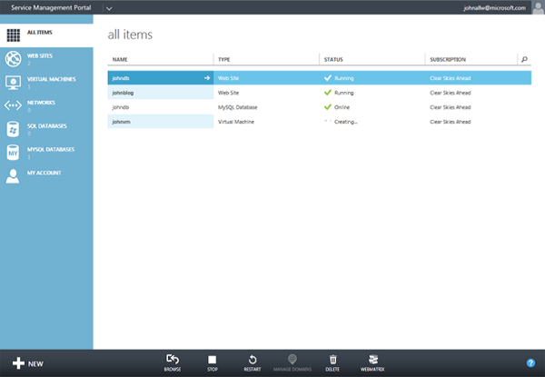
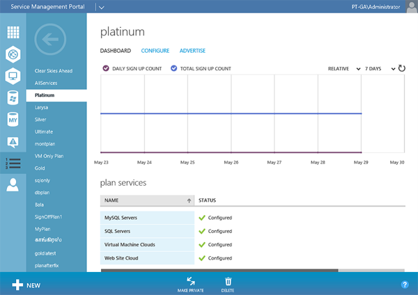
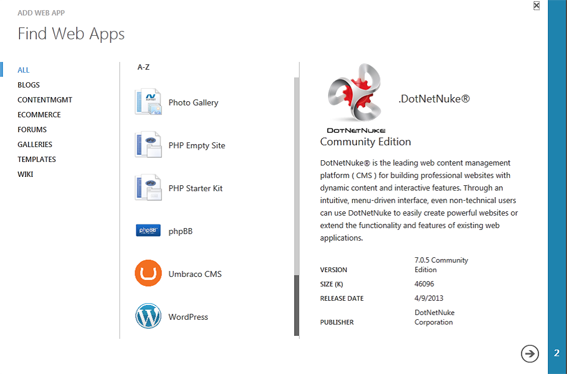
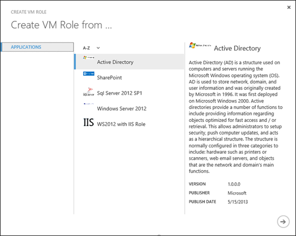

#Microsoft Azure - Windows Azure Pack (WAP)

##**Daniel Donda**
**MVP**
Março, 2014

Antes conhecido como Windows Azure Services para Windows Server o Windows Azure Pack (WAP) foi lançado em Janeiro de 2013. 

O WAP é um portal (Self-Service) baseado no portal do Windows Azure e tem como principal objetivo trazer todo o poder da tecnologia do Windows Azure aliada com o Windows Server e o System Center 2012 as empresas e prestadores de serviços terem a capacidade de entregar de serviços Web PAAS - Platform-as-a-Service e IAAS - Infrastructure-as-a-Service on premisses. Criando cenários de nuvem pública, privada e híbrida. Tudo isso sem custo adicional.

O WAP nos fornece a principio dois portais, um para os administradores e outro para os usuarios finais (Tenants).
* Portal do Cliente (Tenant Portal) – Permite ao cliente provisionar, monitorar e gerenciar serviços, como Sites, Máquinas Virtuais e Service Bus. Estes e outros serviços estão descritos mais abaixo neste artigo.

* Portal do Administrador (Admin Portal) – Permite o administrador configurar e gerenciar nuvens, contas de usuários, cotas e preços.

Usando o WAP você pode integrar diversos serviços que deseja fornecer aos seus clientes como por exemplo:
* Web Gallery – Usando o WAP é possível fornecer uma galeria de aplicativos WEB, fornecendo aos clientes a flexibilidade de poder escolher entre vários frameworks como ASP.NET, ASP, PHP e Node.js.

* Virtual Machines – Integrando com o System Center Virtual Machine Manager o WAP fornece a capacidade de provisionamento de maquinas virtuais usando o Service Provider Foundation (SPF) fornecido com o Microsoft System Center Orchestrator, permitindo que provedores de serviços e organizações de grandes empresas possam oferecer capacidades de IaaS para seus clientes ou usuários.

* Banco de dados – O Windows Azure Pack também permite oferecer aos seus usuários o acesso ao seu SQL existente e bancos de dados MySQL para uso com suas aplicações.
* Automação (Runbooks) – Através do Service Management Automation (SMA) um componenete do System Center Service Manager e do PowerShell Workflow é possível criar runbooks para automatização do datacenter.
Service BUS - Se os aplicativos são executados na nuvem ou on-premises, elas precisam interagir com outros sistemas e aplicações. Windows Azure Pack oferece o Service Bus para permitir que os aplicativos dos usuários possam integrar aplicações de forma confiável usando um barramento de mensagens.

**Conclusão –O Windows Azure Pack** é uma solução única que de forma simples e fácil proporciona auto serviço multi-tenant para empresas e provedores de serviços usando as tecnologias associadas do Windows Server e do System Center 2012.

Referencia: [**Microsoft Server and Cloud Platform**](https://www.microsoft.com/en-us/cloud-platform/windows-azure-pack#fbid=ZU_YSneIKoV) 
