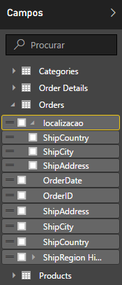
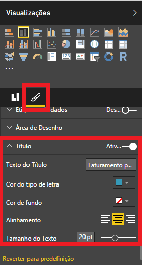

#drill-down no Power BI

##**Renato Haddad**
**MVP ASP.NET /MCP/MCTS/MCPD/RD**
Novembro, 2015

[Blog](http://weblogs.asp.net/renatohaddad/)

O Power BI é uma ferramenta de relatórios que a Microsoft criou para ser usada por qualquer pessoa. Ela é tão interativa e intuitiva que profissionais como analista de negócios, analista de dados, desenvolvedores de softwares, gerentes e diretores de diversas áreas conseguem montar relatórios fantásticos.
O objetivo deste artigo é explorar o conceito de DrillDown, ou seja, a partir de uma fonte de dados relacionada, como vendas por categorias, produtos, pedidos e detalhes do pedido, conseguimos navegar diretamente no relatório, a fim de pesquisar e chegar até o ponto desejado de visualização destes dados. A figura 1 mostra um dashboard com alguns tipos de gráficos que o Power BI disponibiliza.

Figura 1 – Dashboard no Power BI

Neste exemplo utilizarei o Power BI Desktop e a fonte de dados em SQL Server com o banco Northwind, o qual você consegue fazer download diretamente no site codeplex.com. 

#Fonte de Dados

Assim que o Power BI Desktop é aberto, clique em Obter Dados. Aponte para a fonte “Base de Dados do SQL Server”, conforme a figura 2. Cabe ressaltar que você pode usar qualquer fonte de dados disponível, pois nesta última versão (fevereiro/2016), há quase todas disponíveis, desde um arquivo CSV, Excel, JSON até Azure, Web, diversas bancos de dados.

Figura 2 – Selecionar SQL Server

Clique no botão Ligar (o meu está com a versão Português / Portugal, mas em inglês é Connect). Na janela aberta, informe o nome do servidor (EARTH no meu caso, poderia ser local ou o número IP), e o banco de dados Northwind, conforme a figura 3.

Figura 3 – Dados para se conectar ao servidor e banco

Se você digitar apenas o nome do servidor e clicar no botão OK, serão exibidos todos os bancos de dados. Selecione o Northwind e as seguintes Entidades: Categories, Products, Order e Order Details, conforme a figura 4.

Figura 4 – Entidades selecionadas

Clique no botão Carregar e aguarde. No lado direito da janela teremos as quatro entidades listadas em Campos. Dependendo da quantidade de campos da entidade, você clicar com o botão direito sobre o campo e selecionar Ocultar, sendo que fiz este procedimento com diversos campos das entidades, deixando apenas os que irei utilizar.

#Preparar os Dados

O primeiro passo para organizar os dados é saber como montar uma estrutura. Neste caso, vamos organizar as vendas por país, seguido de cidades. Na entidade Orders (Pedidos), clique com o botão direito sobre o campo ShipCounty e selecione “Nova hierarquia”, conforme a figura 5. Isto criará um grupo onde o topo da hierarquia é o país.

Figura 5 – Nova hierarquia por país.

Veja que será criado um campo “ShipCountry Hirarquia”, contendo apenas o campo ShipCountry. Agora é preciso adicionar os campos ShipCity e ShipAddress à hierarquia criada. Clique com o botão direito em cada campo e selecione “Adicionar o campo à hierarquia ShipCountry”. E, para melhor organização e facilitar o entendimento, clique com o botão direito na hierarquia criada e renomeie para Localização, conforme a figura 6.

Figura 6 – Hierarquia Localização criada

Agora precisamos criar um campo calculado contendo o valor do faturamento. Para isto, selecione a entidade Order Details (Detalhes do Pedido), no menu Modelação, selecione Nova Coluna. É aberta uma linha para você escrever a fórmula, similar ao Excel. Neste caso, digite Faturamento (que será o nome do campo) = Quantity * UnitPrice. Veja na figura 7 a fórmula montada, e saiba que quando você começa digitar o nome do campo, é exibida uma lista com o nome da entidade antes. Para efetivar a fórmula, clique no ícone parecido com um “tick ou aprovado”.

Figura 7 – Campo calculado de Faturamento

#Montar o Gráfico DrillDown

Conforme a figura 8, selecione o tipo de gráfico chamado Gráfico de Colunas Empilhadas (segundo tipo na lista). Os campos a serem usados são a Localização e o Faturamento. A localização já é inserida no eixo, exibindo toda a hierarquia. E, o Faturamento arraste para o campo de Valor.

Figura 8 – Estrutura do relatório

O seu gráfico deve estar similar a figura 9, sendo que os países são exibidos no eixo X, os valores no eixo Y, com as devidas escalas de valores. Se você posicionar o mouse sobre cada coluna, irá visualizar o respectivo valor.

Figura 9 – Relatório com gráfico

E o DrillDown, onde está? Se você visualizar os dois símbolos do lado esquerdo superior do gráfico, verá uma seta para cima e duas para baixo. Clique nas duas setas e terá uma visão de faturamento por cidades, conforme a figura 10. E assim, clicando nas setas é que você irá navegar.

Figura 10 – Faturamento por cidades

Agora, e como saber qual o faturamento apenas em um determinado país, Brasil por exemplo? No gráfico, volte na visualização inicial dos países. Note na figura 11, o ícone que liga ou desliga a navegação para o próximo nível, aquele com a seta para baixo do lado direito superior. Deixe ligada ou ativada, clique no país desejado, Brasil neste caso, e conforme a figura 12, serão filtradas todas as cidades deste país. Cada coluna do gráfico representa a cidade com o respectivo faturamento.

Figura 11 – Faturamento das cidades por país

E, se você lembrar que quando montamos a hierarquia de dados no campo Faturamento, temos países, cidades e endereços (ShipAddrees). Portanto, como a navegação está ativada, clique em uma cidade e veja o gráfico gerado por endereço, conforme a figura 12.

Figura 12 – Faturamento por endereço

Para finalizar o gráfico, resolvi alterar o título do mesmo para Faturamento por País e Cidade. Para isto, em visualizações, clique no ícone Formato, localize Titulo / Texto do Título e digite o título que quiser, conforme a figura 13. E você pode aplicar cor do texto, cor do fundo, tamanho do texto e alinhamento. Fique à vontade para formatar como desejar.

Figura 13 – Formatar título do gráfico

Agora você pode criar outros gráficos com a mesma fonte de dados, por exemplo, faturamento por categoria de produtos.

#Conclusão
Este tipo de gráfico DrillDown no Power BI é fantástico para oferecer aos usuários uma navegação profunda nos dados, de acordo com a análise e necessidade do cliente. E, depois de criar todos os gráficos você pode montar um painel e disponibilizar num Dashboard das aplicações.
Agradeço a oportunidade de poder compartilhar o conhecimento deste artigo. Qualquer dúvida e necessitando de treinamento, por favor me contate.

#Sobre o Autor
Renato Haddad rehaddad@msn.com – www.renatohaddad.com é MVP, MS Regional Director, MCPD e MCTS, palestrante em eventos da Microsoft em diversos países, ministra treinamentos focados em produtividade com o VS.NET 2013/2015, ASP.NET Core, 4/5, Power BI, Entity Framework, Reporting Services, Universal Windows Platform. Visite o blog http://weblogs.asp.net/renatohaddad.
